Open data on the sea shore
==========================
DjangoCon 2014 - Embiez

---

OpenSeaMap.org
------------
The free nautical chart

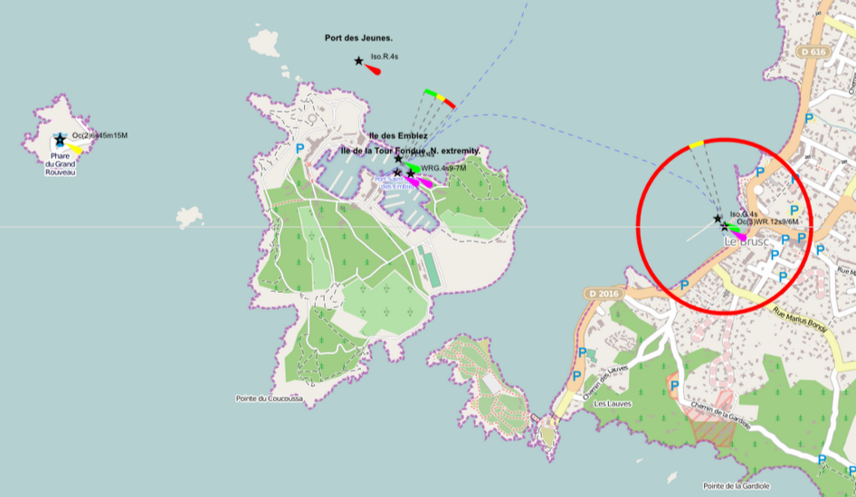

---

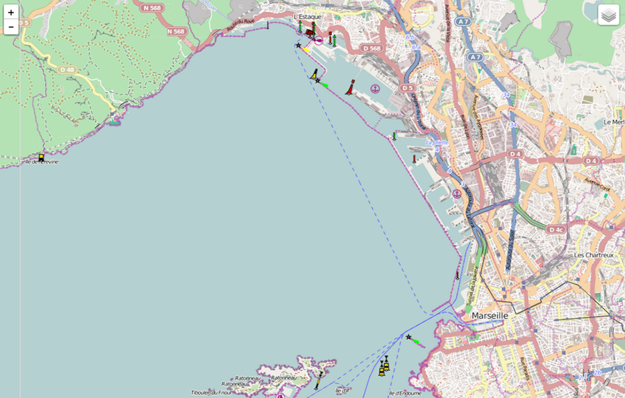

---

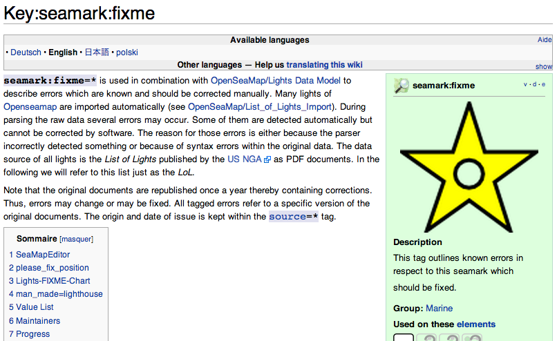

---

Depth.OpenSeaMap.org
--------------------

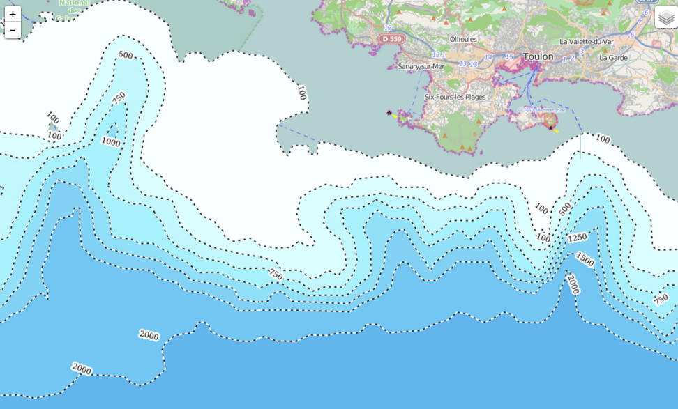

---

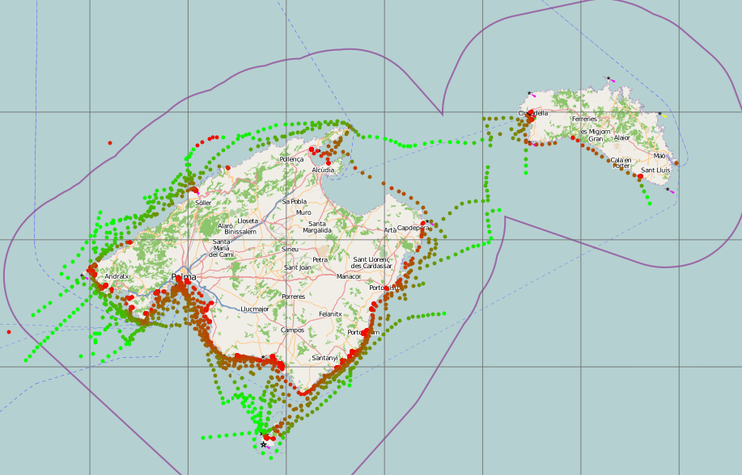

---

Open sea map data logger

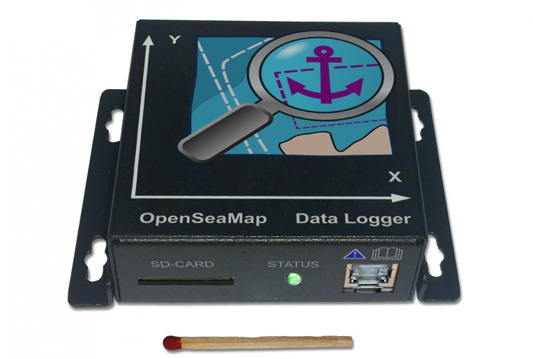

---

OpenWeatherMap
----------------

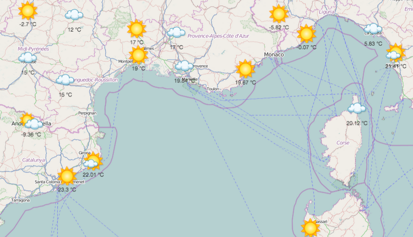

*"OpenWeatherMap is startup that offers free current weather data, forecasts and history data to the developers of web-services and mobile applications."*

---

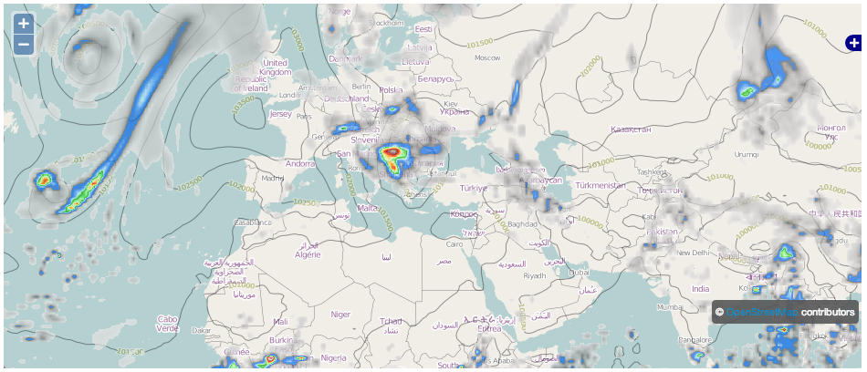

---
NOAA
----

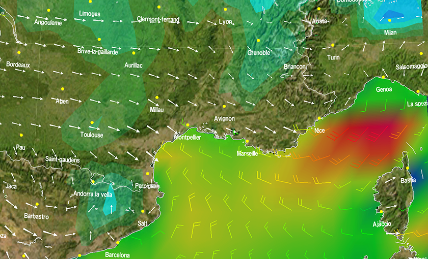

---

OpenMeteoFoundation
-------------------

*The Open Meteo Foundation (OMetFn) is a non-profit organization founded in 2012 and dedicated to promote open data, open knowledge, open technology and open science in the field of meteorology.*

---

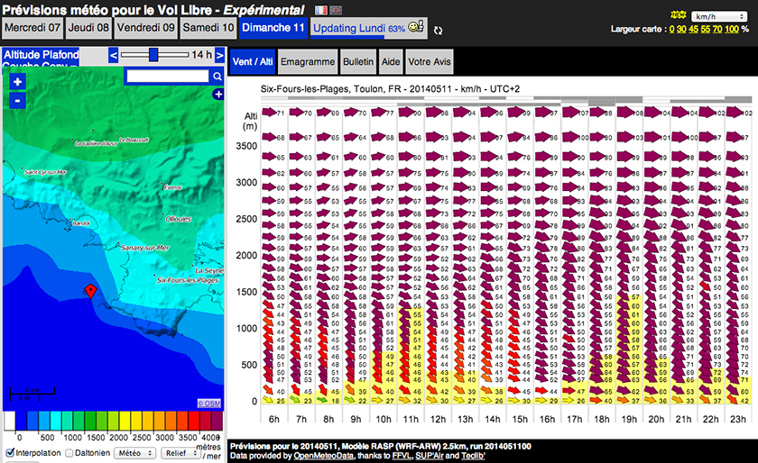

http://meteo-parapente.com/

---

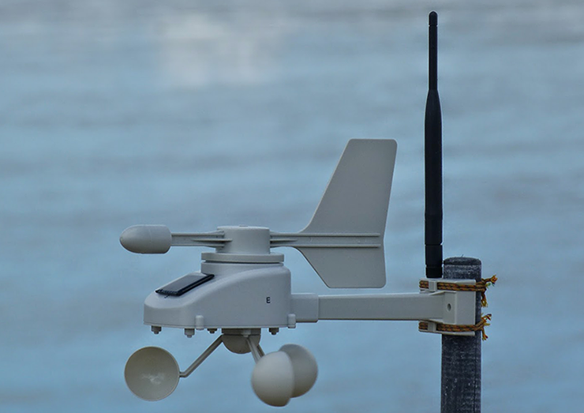

http://openmeteostation.org/

---

AIS Tracking
---

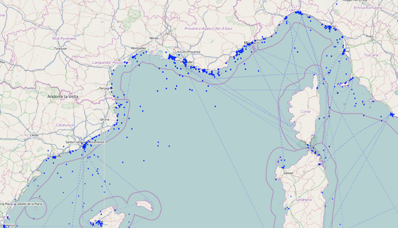

---

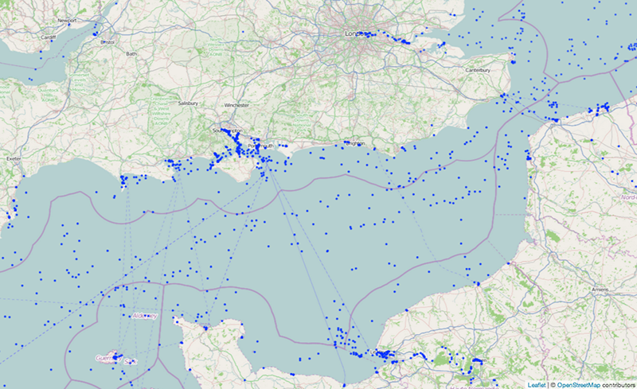

---

SkipperGuide.de
-------------

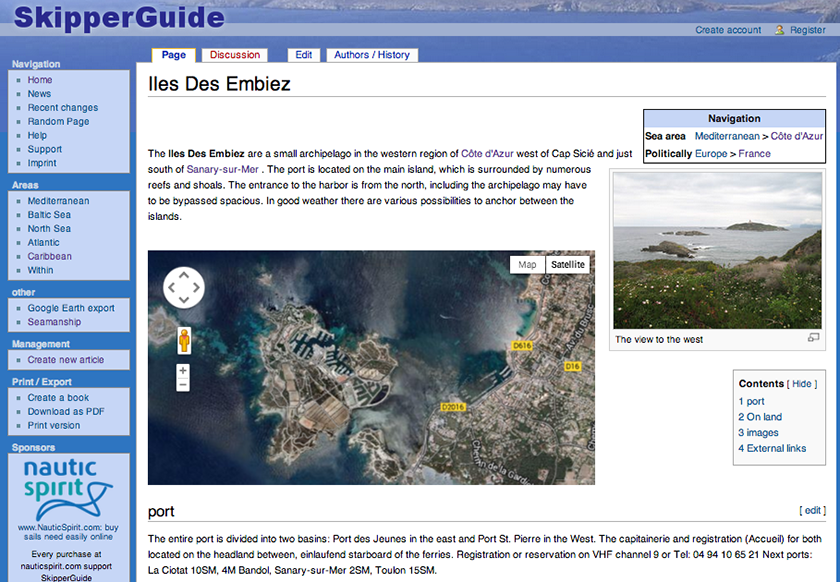

---

Conclusion
----------

Image guide cotié d'embiez
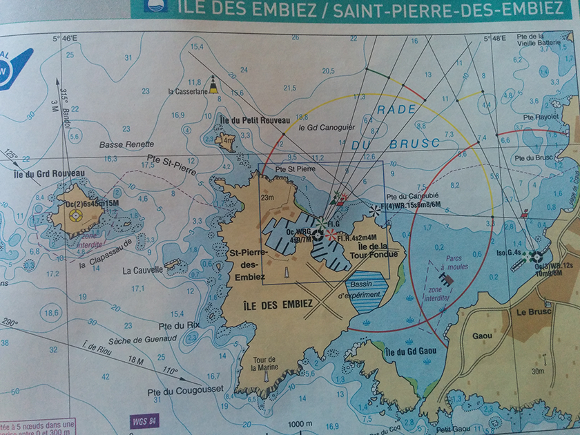

---

Richard Moch
------------

richard.moch@gmail.com

https://github.com/rmoch

## France Université Numérique

https://www.france-universite-numerique-mooc.fr/

---

Merci
=====

References:

http://openseamap.org

http://openweathermap.org/

http://www.noaa.gov/

http://ready.arl.noaa.gov/READYcmet.php

https://openmeteoforecast.org

http://openmeteostation.org/

http://www.wrf-model.org/

http://www.skipperguide.eu

Safety on the Open Sea - Bernhard Fischer
http://events.ccc.de/congress/2010/Fahrplan/events/4183.en.html

OpenMeteo Foundation - Nicolas Baldeck (fr)
https://www.youtube.com/watch?v=5B2oBE0bW_c

OpenSeaMap NMEA 2-Kanal-Logger
http://www.ak-modul-bus.de/cgi-bin/iboshop.cgi?showd1100!0,958422808020556,OSM1E